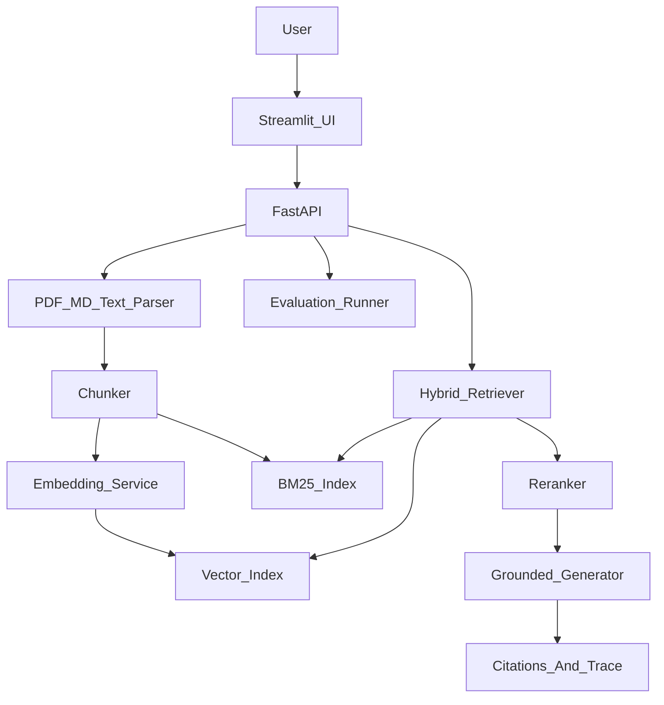

# ResearchPilot

ResearchPilot 是一个面向个人科研资料的 RAG 知识助手，目标不是做一个简单的“PDF 聊天”Demo，而是展示完整 RAG 工程能力：文档解析、chunk 策略、混合检索、rerank、引用溯源、离线评测和可部署后端。

## 功能

- 支持 PDF、Markdown、TXT 和手动文本导入。
- 保留文档标题、来源、页码、章节、chunk 策略等 metadata。
- 提供 fixed、recursive、heading-aware 三种 chunk 策略。
- 使用 dense embedding + BM25 做混合检索，并支持云端重排模型（失败回退词法重排）。
- 支持按 `domain` 和 `knowledge_base_id` 隔离不同领域知识库。
- 支持 Qdrant-backed 离线向量知识库，也保留本地 JSON fallback。
- 对候选片段执行 rerank，返回答案、引用来源、分数和 trace。
- 提供 retrieval eval：`recall@k`、`Hit@k`、`MRR`、`context precision`；可选生成侧 `faithfulness` / `answer_relevance`（RAGAS 或 LLM-as-judge）。
- 提供 FastAPI 后端、Streamlit 前端和 Docker Compose 编排。
- 可选 CLIP 统一向量空间（方案 1A）：图搜图 / 图搜文 / 文搜图；图片 chunk 同时写入 `text_vec`（OCR/caption）与 `image_vec`（像素）。

## 架构



## 快速开始

```bash
python -m venv .venv
.venv\Scripts\activate
pip install -e ".[dev,eval]"
uvicorn backend.app.main:app --reload
```

另开一个终端启动前端：

```bash
streamlit run frontend/app.py
```

Docker 启动：

```bash
docker compose up --build
```

如果只想用 Docker 启动本地 Qdrant，后端和前端继续用 conda 跑：

```bash
docker compose up qdrant
```

然后在后端终端设置：

```bash
set VECTOR_STORE=qdrant
set QDRANT_URL=http://localhost:6333
uvicorn backend.app.main:app --reload
```

访问：

- API: `http://localhost:8000/docs`
- 前端: `http://localhost:8501`
- Qdrant: `http://localhost:6333`

## API 示例

导入文本：

```bash
curl -X POST http://localhost:8000/api/documents/text ^
  -H "Content-Type: application/json" ^
  -d "{\"title\":\"RAG Notes\",\"text\":\"RAG combines retrieval and generation...\",\"source\":\"notes\",\"domain\":\"ai_research\",\"knowledge_base_id\":\"kb_ai_research\"}"
```

提问：

```bash
curl -X POST http://localhost:8000/api/ask ^
  -H "Content-Type: application/json" ^
  -d "{\"question\":\"RAG 的检索阶段为什么重要？\",\"top_k\":5,\"use_rerank\":true,\"domain\":\"ai_research\",\"knowledge_base_id\":\"kb_ai_research\"}"
```

查看指定知识库统计：

```bash
curl "http://localhost:8000/api/knowledge-bases/stats?domain=ai_research&knowledge_base_id=kb_ai_research"
```

图片检索 / 问答（需开启 CLIP，见下节）：

```bash
curl -X POST http://localhost:8000/api/ask/image ^
  -F "file=@query.png" ^
  -F "question=这张图和哪些笔记相关？" ^
  -F "top_k=6" ^
  -F "use_rerank=true"
```

## CLIP 多模态（可选）

默认关闭。开启后使用统一 CLIP 空间：同一 image chunk 可有 `text_vec` + `image_vec`，任一命中即召回该 chunk。

```bash
# .env（默认 ENABLE_CLIP_MULTIMODAL=true）
ENABLE_CLIP_MULTIMODAL=true
CLIP_TEXT_MODEL=sentence-transformers/clip-ViT-B-32-multilingual-v1
CLIP_IMAGE_MODEL=clip-ViT-B-32
VECTOR_STORE=local   # 或 qdrant
# CLIP ViT-B/32 一般为 512 维；若与旧 MiniLM(384) 混用会维度不兼容，必须重建索引
```

注意：

1. `local` 与 `qdrant` 均支持 CLIP 双向量（`text` + `image` named vectors）。Qdrant 若检测到旧单向量/维度不符，会**自动删库重建**（需重新入库）。
2. 开启或切换 embedding 后请对含图文档 **force_reindex**。
3. 前端主页可上传查询图，点击「图片检索/问答」调用 `/api/ask/image`。
4. 文字问题用文本塔编码后会同时搜 `text`/`image`（统一空间）；图片查询同理。

## 评测

离线种子语料在 `datasets/seed_research/`（公开资料二次整理，含 RAG 与 EMG–NIRS 笔记）。一键入库并生成真实 chunk id 的 golden set：

```bash
python scripts/seed_research_kb.py --force-reindex --evaluate
# 可选：再评 faithfulness / answer_relevance（会调用 LLM，较慢）
python scripts/seed_research_kb.py --skip-ingest --evaluate --include-generation
```

产出：

- 知识库 id：`kb_research_seed`
- Golden set：`datasets/golden_set.seed.jsonl`
- 报告：`storage/eval_seed_report.json`

API：

```bash
curl -X POST http://localhost:8000/api/evaluate ^
  -H "Content-Type: application/json" ^
  -d "{\"dataset_path\":\"datasets/golden_set.seed.jsonl\",\"top_k\":5,\"use_rerank\":true,\"include_generation\":false,\"knowledge_base_ids\":[\"kb_research_seed\"]}"
```

建议最终 README 中补充实验表格：

- Baseline dense retrieval 的 `recall@5`、`Hit@5`、`MRR`。
- Hybrid retrieval 后的提升。
- Hybrid + rerank 后的提升。
- 生成侧 faithfulness / answer_relevance。
- 平均延迟和 token 成本。

### 检索对比实验（四臂）

在种子库与 golden set 就绪后：

```bash
# 仅检索四臂
python scripts/run_retrieval_ablation.py --suite retrieval
# 仅查询优化两臂（会自动入库干扰知识库 kb_distractor）
python scripts/run_retrieval_ablation.py --suite query_opt
# 全部
python scripts/run_retrieval_ablation.py --suite all
```

报告写入 `storage/ablation_report.json`，控制台打印 Hit@k / MRR / Recall / Context Precision 与耗时。

### RAGAS 生成质量评测（full_opt）

在 golden set 上走线上同款 `ask` 链路（路由 + 查询扩展 + hybrid+rerank + 二次检索），再评：

`faithfulness` / `answer_relevance` / `context_precision` / `context_recall` / `answer_correctness`

```bash
python scripts/run_ragas_eval.py
# 报告: storage/ragas_report.json
```

## 简历描述

- 设计并实现面向科研文献的个人 RAG 知识助手，支持 PDF/Markdown/文本解析、章节级 metadata 提取、混合检索、rerank、引用溯源和科研问答工作流。
- 构建领域 QA golden set，使用 `recall@k`、`MRR`、`context precision` 和 RAGAS 评估检索与生成质量，通过 hybrid retrieval + reranker 持续优化召回效果。
- 基于 FastAPI + Streamlit + Docker Compose 实现可部署服务，记录每次请求的召回片段、重排分数和引用来源，支持失败样本分析。
